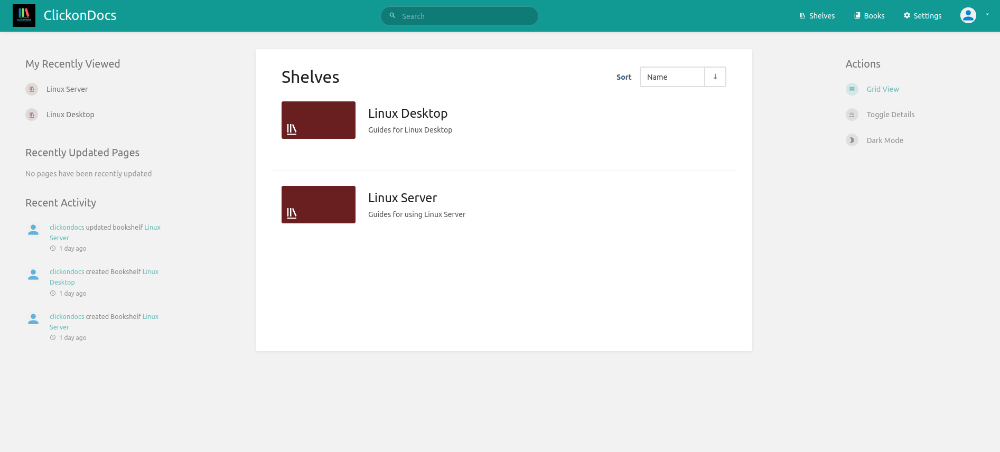
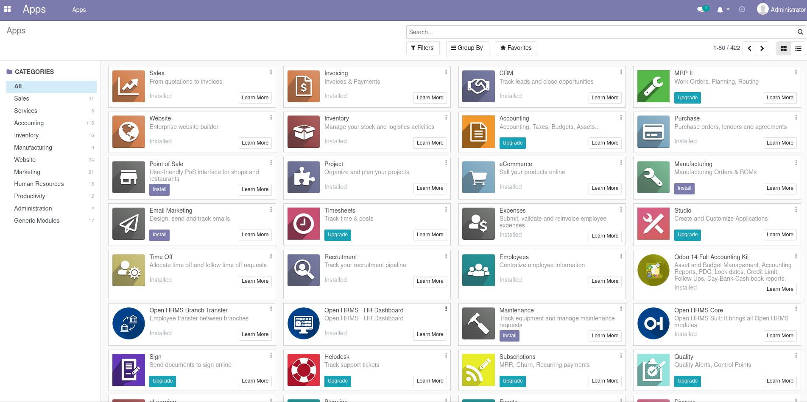
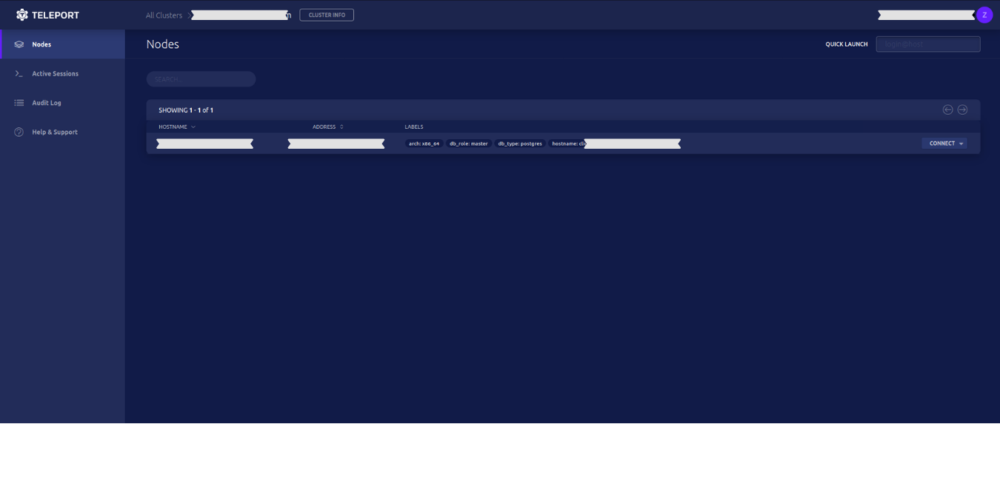

# Overview

## Your Dashboard

Keep all your server applications, browser links & favourites saved in 1 dashboard with 'Organizr', so you can easily keep track of your work. Set and allow tabs for visitors, and tabs for internal users.

## Your Documentation

Bookstack provides an easy to use documentation application, with a modern UI. Featuring WYSIWYG and Markdown editors.

## Your Website

Odoo's website builder tool is great for quickly creating a stunning looking website. With tons of integrations such as your personal library of Unsplash images, and connection to your Odoo business/backend, allows you to run your own website and business at the same time, from the same place.

With hundreds of official and 3rd party modules to choose from.

##  Your Administration

Featuring a collection of browser based administrative type applications, turning CLI into GUI making server management, container management, and security a cinch.

### Nginx Proxy Manager

### Cockpit - Server GUI

### Portainer

### Teleport

